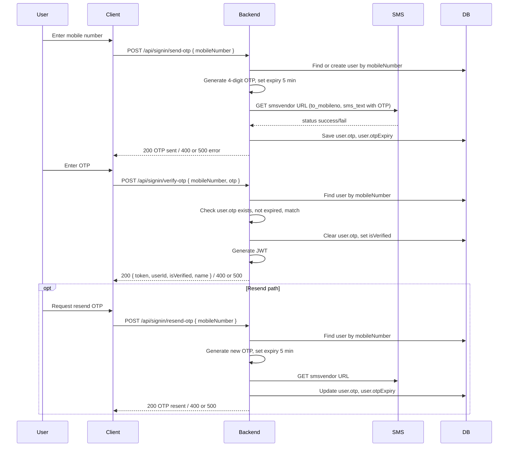

# OTP Process Workflow

## 1. Purpose

This document is a **portable spec** for the OTP (One-Time Password) process used in this project. It describes the complete flow: send OTP, verify OTP, and resend OTP. When given to another project with the instruction **"do it otp process"**, that project can implement the same flow correctly using this workflow and the referenced credentials/config.

---

## 2. Credentials / Config

OTP behaviour depends on the following configuration.

### Config file: `src/config.json`

| Key | Used for OTP | Description |
|-----|--------------|-------------|
| `smsvendor` | Yes | Full SMS gateway URL including query parameters. The URL must end with `&` so that `to_mobileno=` and `sms_text=` can be appended. Typical params in the URL: `type`, `user`, `pass`, `sender`, `t_id`. |

**Example structure (use your own values; do not commit real secrets):**

```json
"smsvendor": "https://your-sms-gateway.com/api?type=smsquicksend&user=YOUR_USER&pass=YOUR_PASS&sender=SENDER_ID&t_id=TEMPLATE_ID&"
```

For this project, the actual config is in [src/config.json](../src/config.json). In another project, you can use environment variables or a similar config file; keep credentials out of version control where possible.

### JWT (Verify step)

- **Environment variable:** `JWT_SECRET` (used in [src/auths/generateToken.js](../src/auths/generateToken.js)).
- Token is issued only after successful OTP verification; expiry is 4 weeks.

---

## 3. Flow Diagram



---

## 4. Data Model (OTP-related)

User entity must include these OTP-related fields:

| Field | Type | Required | Description |
|-------|------|----------|-------------|
| `mobileNumber` | string | Yes | Exactly 10 digits; unique. |
| `otp` | string | No | Current OTP value; set on send/resend, cleared after successful verify. Default `null`. |
| `otpExpiry` | date | No | When the OTP expires (e.g. 5 minutes from generation). Default `null`. |
| `isVerified` | boolean | No | Set to `true` after successful verify when user has a valid name (or per your rule). Default `false`. |

After successful verification: set `user.otp = null` (and optionally clear `user.otpExpiry`). Reference: [src/models/User.js](../src/models/User.js).

---

## 5. API Contract

Base path: **`/api/signin`**. All request/response bodies are `application/json`.

### 5.1 Send OTP

| Item | Value |
|------|--------|
| Method | `POST` |
| Path | `/api/signin/send-otp` |
| Body | `{ "mobileNumber": "9876543210" }` |
| Validation | `mobileNumber` required, string, exactly 10 digits, not all zeros. |

**Responses:**

| Status | Body |
|--------|------|
| 200 | `{ "message": "OTP sent successfully" }` |
| 400 | `{ "error": "..." }` (e.g. invalid/missing mobile, validation failed) |
| 500 | `{ "error": "..." }` or `{ "error": "Failed to send OTP via SMS", ... }` |

### 5.2 Verify OTP

| Item | Value |
|------|--------|
| Method | `POST` |
| Path | `/api/signin/verify-otp` |
| Body | `{ "mobileNumber": "9876543210", "otp": "1234" }` — `enteredOTP` may be used in place of `otp`. |
| Validation | Both `mobileNumber` and `otp` (or `enteredOTP`) required. |

**Responses:**

| Status | Body |
|--------|------|
| 200 | `{ "message": "OTP verified successfully", "userId": "...", "token": "JWT...", "isVerified": true/false, "name": "..." \| null }` |
| 400 | `{ "message": "..." }` (user not found, no OTP, OTP expired, incorrect OTP) |
| 500 | `{ "error": "Failed to verify OTP" }` |

### 5.3 Resend OTP

| Item | Value |
|------|--------|
| Method | `POST` |
| Path | `/api/signin/resend-otp` |
| Body | `{ "mobileNumber": "9876543210" }` |
| Validation | `mobileNumber` required; user must exist. |

**Responses:**

| Status | Body |
|--------|------|
| 200 | `{ "message": "OTP resent successfully" }` |
| 400 | `{ "message": "User not found" }` |
| 500 | `{ "error": "..." }` |

---

## 6. Business Rules

- **OTP format:** 4-digit numeric, range 1000–9999. Generate with: `Math.floor(1000 + Math.random() * 9000).toString()`.
- **OTP expiry:** 5 minutes from generation. Store as `otpExpiry`; on verify, reject if `new Date() > new Date(user.otpExpiry)`.
- **Test number (optional):** For a specific test mobile number (e.g. `9698790921`), you may return a fixed OTP (e.g. `8790`) instead of sending SMS. Document the values if you keep this.
- **SMS sending:** Use HTTP GET to the composed URL: `{config.smsvendor}to_mobileno={mobileNumber}&sms_text={encoded message}`. Message text example: `Dear Applicant, Your OTP for Mobile No. Verification is {otp} . MJPTBCWREIS - EVOLGN`. Treat success only when `response.data.status === "success"`. On failure, return 500 and do **not** save OTP to the user.
- **Verify logic:** User must exist; `user.otp` must be non-null; `user.otpExpiry` must not be in the past; compare `String(user.otp).trim() === String(enteredOTP).trim()`. On success: clear `user.otp`, set `isVerified` (e.g. based on whether `user.name` is present), generate JWT, return token and user info.
- **Resend:** Only for existing users. Generate new OTP and new expiry; send SMS; update `user.otp` and `user.otpExpiry`; do not clear `isVerified`.

---

## 7. Implementation Checklist for Another Project

Use this checklist when implementing "do it otp process" in another project:

- [ ] Add config or env for SMS gateway URL (`smsvendor`). Optionally add `JWT_SECRET` for verify step.
- [ ] Define User model with: `mobileNumber` (10 digits, unique), `otp` (string, nullable), `otpExpiry` (date, nullable), `isVerified` (boolean).
- [ ] Implement `generateOTP()` returning a 4-digit string (1000–9999).
- [ ] Implement **sendOTP**: validate mobile, find or create user, generate OTP and 5-min expiry, call SMS URL (GET), only save OTP if SMS returns success; respond 200/400/500.
- [ ] Implement **verifyOTP**: validate body, find user, check OTP exists and not expired, compare OTP; on success clear OTP, set `isVerified`, generate JWT, return token and user info.
- [ ] Implement **resendOTP**: find user by mobile, generate new OTP and expiry, send SMS, update user, return 200/400/500.
- [ ] Expose POST routes: `/send-otp`, `/verify-otp`, `/resend-otp` under your base path (e.g. `/api/signin`).
- [ ] Keep request/response shapes and status codes as above so clients (e.g. Postman, frontends) remain compatible.

**Reference implementation in this project:**

- [src/controllers/OTPController.js](../src/controllers/OTPController.js)
- [src/routes/userRoutes.js](../src/routes/userRoutes.js)
- [src/models/User.js](../src/models/User.js)
- [src/config.json](../src/config.json)
- [src/auths/generateToken.js](../src/auths/generateToken.js)
